layout: true

<div class="my-footer">
<!--img class='logo_l' style='max-width:11%' src='extra/usav_tech_logo.png' /-->
<a style="position:absolute; top:50px; bottom:0; left:40%; right:0;"href="https://openvolley.org">openvolley.org</a>
<a href="https://openvolley.org/"></a>
</div>

---

```{r setup, include=FALSE}
options(htmltools.dir.version = FALSE)
options(knitr.kable.NA="")
knitr::opts_chunk$set(fig.path = "figure/", echo = FALSE, warning = FALSE, message = FALSE, cache = FALSE, dpi = 120, comment = "")
library(htmltools)
library(dplyr)
library(formattable)
library(ggplot2)
library(ggsci)
library(datavolley)
library(ovdata)
library(ovlytics)
`%eq%` <- function(x,y) x==y & !is.na(x) & !is.na(y)
options(dplyr.summarise.inform = FALSE)
options(tibble.width = 70)
```

class: inverse, ovlogo

# The openvolley project

https://openvolley.github.io/community/talks/overview/

```{r qr, include = FALSE}
qrimg <- "qrcode.png"
if (!file.exists(qrimg)) {
    png(filename = qrimg, width = 320, height = 320)
    library(qrcode)
    qrcode_gen("https://openvolley.github.io/community/talks/overview/", plotQRcode = TRUE)
    dev.off()
    magick::image_write(magick::image_trim(magick::image_read(qrimg)), qrimg)
}
```

<!--img style="background: white; padding:10px; float:right;clear:none; margin:20px; width:30%; image-rendering: crisp-edges;" src="qrcode.png" alt="qrcode" /-->

### Ben Raymond,<br />Adrien Ickowicz

With Mark Lebedew, Tyler Widdison, Dwynne Wight, Christophe Elek, Chad Gordon, Chau Le, Felipe Lima, Michael Mattes, Hugh Nguyen, Francesco Oleni, Giorgio Poetto, Miguel Rivera, Emilie Robles, and many others

<!--div style="margin-top:8em">Presented at the USAV Tech Academy, January 2021</div-->

---

# The openvolley project

https://openvolley.github.io/community/talks/overview/

<!--img style="background: white; padding:10px; float:right;clear:none; margin:20px; width:30%; image-rendering: crisp-edges;" src="qrcode.png" alt="qrcode" /-->

## Presentation overview

- what, why, principles
- an overview of the loot and future directions
- opportunities to get involved

---

# What, why, principles?

2016-ish to now

#### Aim

To develop and foster volleyball analytics approaches that are <strong>*informative*</strong>, <strong>*accessible*</strong>, and <strong>*advanced*</strong>.

Do this by developing <strong>*technical*</strong> and <strong>*community*</strong> resources


---

# What

- software, primarily R-based
  - family of packages (code building blocks)
  - apps
  - documentation

- other community resources
  - example analyses, code snippets
  - discussion fora
  - data

---


# Why R?

Open source and free

Rich functionality for data handling, graphics, apps, report generation

Reproducible, shareable code

Traditional stronghold for statistical research

Package ecosystem (> 15,000 on CRAN, more on Github, Bioconductor, elsewhere)

Rapid growth in functionality, uptake, community

... on the down side: learning curve?

Openvolley aims to lower that barrier

---

# Openvolley R packages

**Fundamentals**: `datavolley` `peranavolley` `ovscout`

**Data**: `ovdata` `fivbvis`

**Analysis**: `volleysim` `ovlytics` `volleyreport` 

**Video**: `ovideo` `ovplayer` `ovva`

**Machine learning**: `ovml` `ovtracking`

---

class: notov, center, middle

# 

https://apps.untan.gl/

---

# datavolley [](https://www.tidyverse.org/lifecycle/#stable)

<span style="float:right; clear:none">https://openvolley.org/datavolley/</span>

Read dvw into R:

```{r eval = FALSE, echo = TRUE}
library(datavolley)

myfile <- "&mlafin_braslovce_nkbm.dvw" ## filename

x <- dv_read(myfile) ## read it in

summary(x) ## print a summary of the match
```

--

```{r echo = FALSE}
x <- dv_read(ovdata_example("mlafin_braslovce_nkbm"))
summary(x)
```

---

#### datavolley

Inside a dvw file:

<div style="height:400px; width:100%; overflow:auto;" >
<pre style="font-size:13px;">
```{r results = "asis"}
cat(x$raw, sep = "\n")
```
</pre>
</div>

---

#### datavolley

Parts:
```{r echo = TRUE}
names(x)
```

---

#### datavolley: file validation

```{r, echo = TRUE, eval = FALSE}
x$messages

```

```{r}
knitr::kable(x$messages[c(5, 6, 7, 9, 10), ], row.names = FALSE)

```

---

#### datavolley: match metadata

```{r echo = TRUE}
names(x$meta)

```

---

#### datavolley: play-by-play data

The `x$plays` component:

<div style="height:400px; width:100%; overflow:auto;" >
<pre style="font-size:13px;">
```{r}
DT::datatable(plays(x), options = list(dom = "tipr"), height = "300px")

```
</pre>
</div>

---

#### datavolley: basics

```{r echo = TRUE}
library(dplyr)

## calculate attack frequency by zone, per team
px <- plays(x)
px %>% dplyr::filter(skill == "Attack") %>%
 group_by(team, player_name) %>%
 dplyr::summarize(N = n(),
          kill_rate = mean(evaluation == "Winning attack")) %>%
 ungroup

```

---

#### datavolley: basics

```{r echo = TRUE}
## attack by rotation, team
px <- ov_augment_plays(px)
px %>% dplyr::filter(skill == "Attack") %>%
 group_by(team, setter_position) %>%
 dplyr::summarize(N = n(),
          kill_rate = mean(evaluation == "Winning attack")) %>%
 ungroup

```

---

#### datavolley: basics

```{r echo = TRUE}
srv <- px %>% dplyr::filter(skill == "Serve") %>%
 group_by(team, player_name) %>%
 dplyr::summarize(N = n(),
          `Ace rate` = mean(evaluation == "Ace"),
          `Error rate` = mean(evaluation == "Error")) %>%
 ungroup %>%
 dplyr::rename("Player name" = "player_name", Team = "team")

```

---

#### datavolley basics: tables

```{r echo = TRUE, eval = FALSE}
DT::datatable(srv, filter = "top")

```

```{r}
DT::datatable(srv, filter = "top", options = list(dom = "tipr"), height = 400) %>%
    DT::formatRound(c("Ace rate", "Error rate"), digits = 3)

```

---

#### datavolley basics: plots

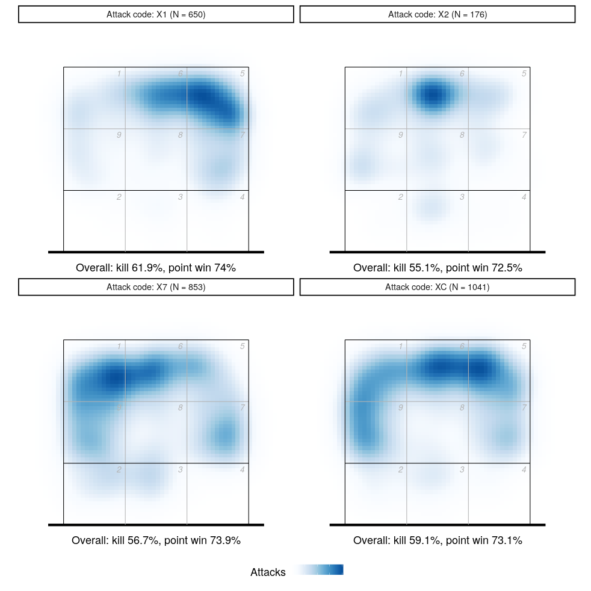

---

#### datavolley basics: plots

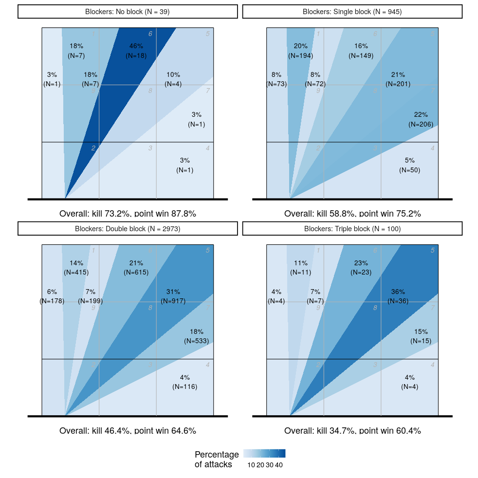

---

#### datavolley basics: plots

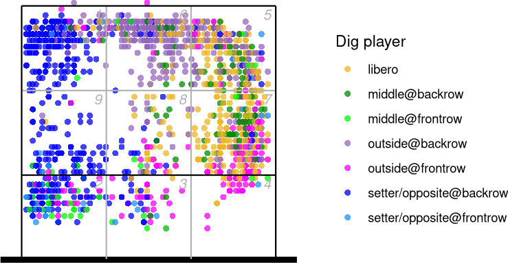

---

#### datavolley basics: plots

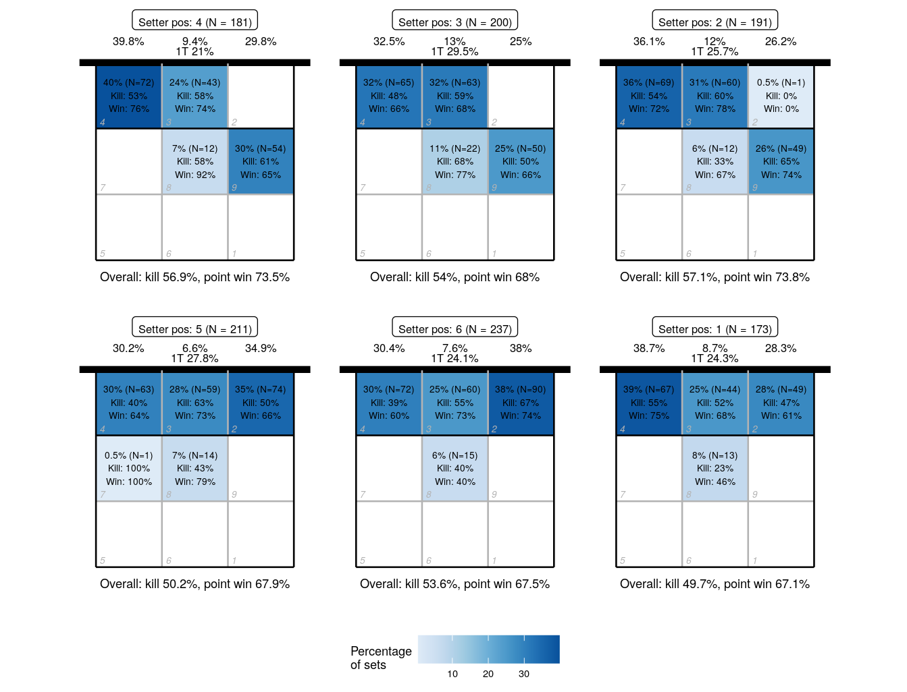

---

#### datavolley basics: plots

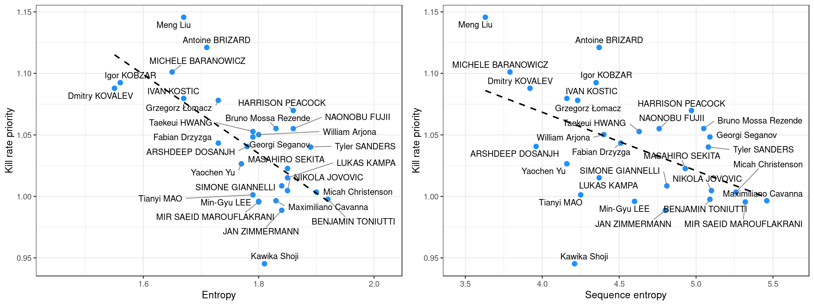

https://untan.gl/comparing-setters.html

---

#### datavolley basics: plots

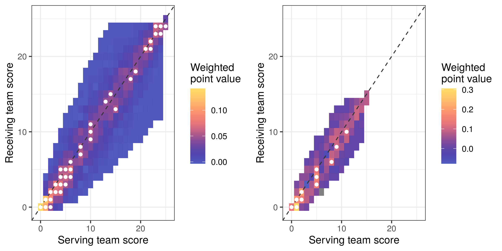

https://untan.gl/point-value.html

---

#### datavolley basics: plots

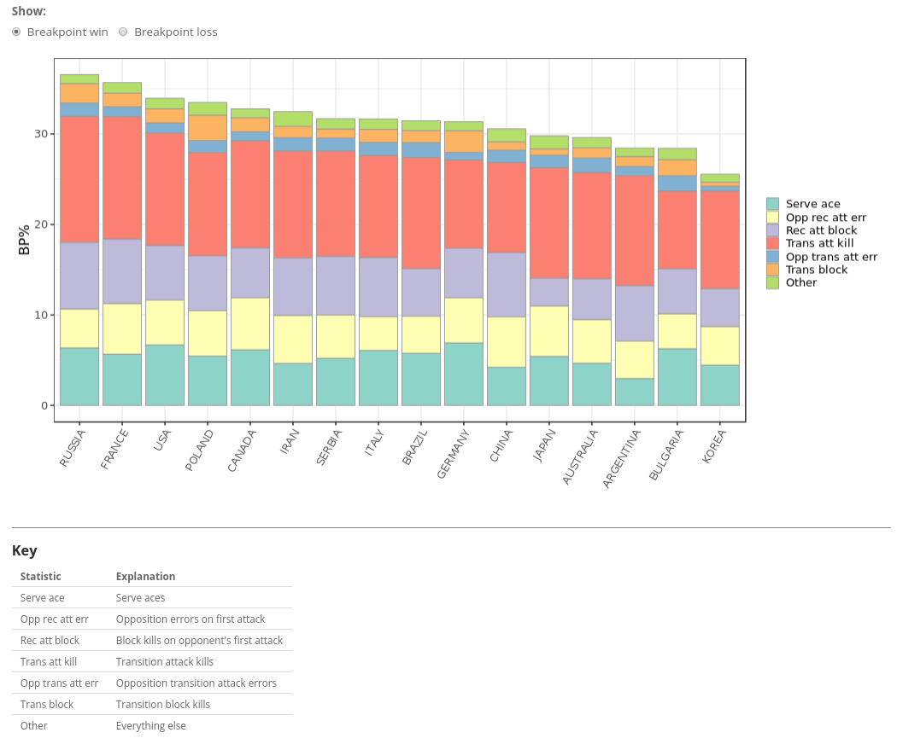

---

#### datavolley basics: plots

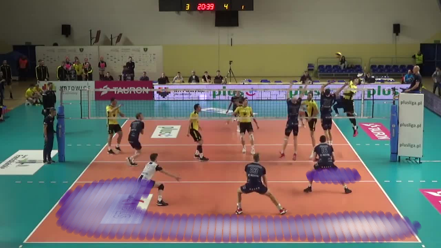

---

# peranavolley [](https://www.tidyverse.org/lifecycle/#stable)

<span style="float:right; clear:none">https://openvolley.org/peranavolley/</span>

- equivalent package for reading AOC VBStats files

```{r echo = TRUE}
library(peranavolley)
x <- pv_read(pv_example_file())
summary(x)

```

---

class: notov

# dvalidate

https://apps.untan.gl/dvalidate/

DataVolley/VBStats file validation, free to use, ~25K files processed

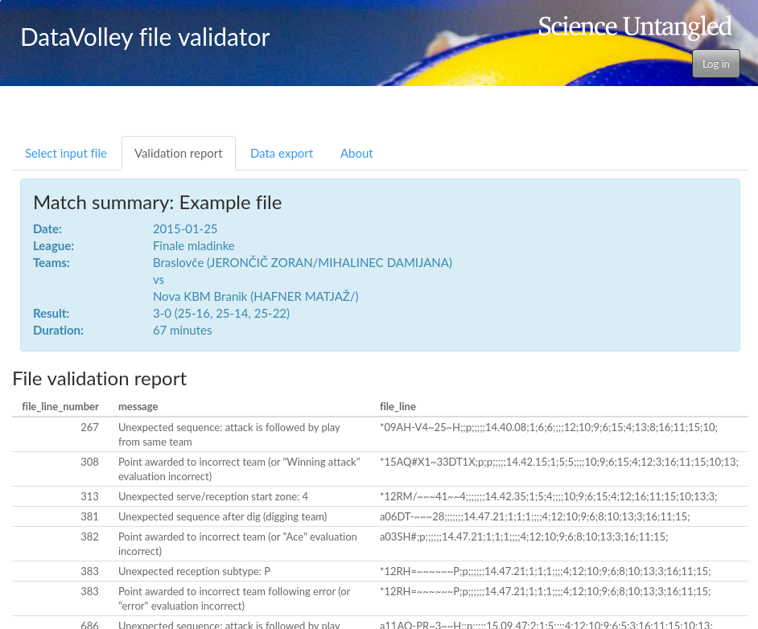
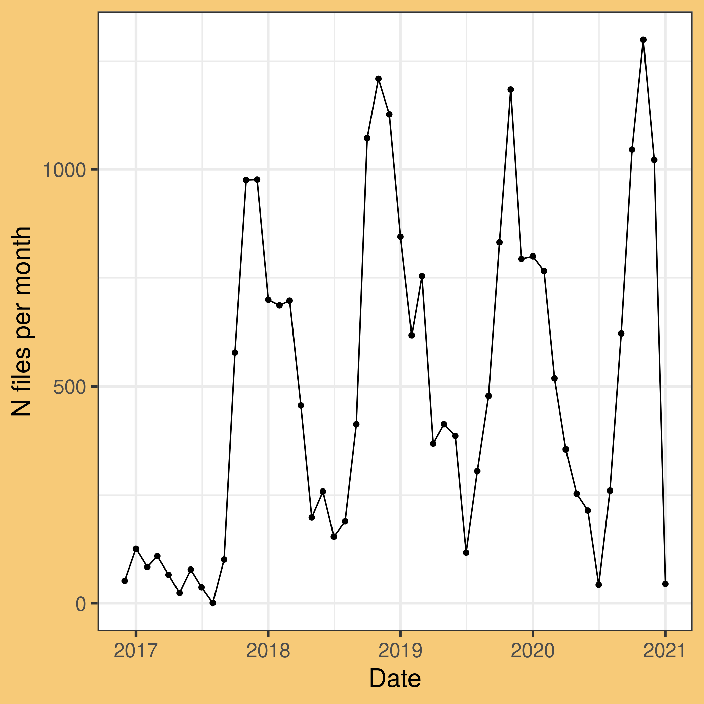

---

# ovscout [](https://www.tidyverse.org/lifecycle/#experimental)

<span style="float:right; clear:left;">https://openvolley.org/ovscout/</span>

Shiny app

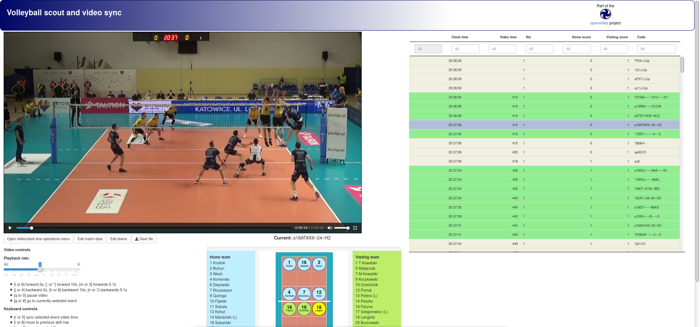

---

# Analytics code snippets

https://openvolley.github.io/volley-analytics-snippets

Code examples, guides, how-tos.

---

# ovlytics [](https://www.tidyverse.org/lifecycle/#experimental)


<span style="float:right; clear:none">https://openvolley.org/ovlytics/</span>

New!

Package for:

- common but nontrivial data handling
  - inferring player roles, setter on court
  - setter repeat patterns

- advanced analytical algorithms
  - volleyball bandit

---

#### ovlytics: the volleyball bandit

See https://untan.gl/setter-choice.html

Which attacker should I set in which situations? Is there an optimal strategy?

- exploration + exploitation
- the "multi-armed bandit" problem

---

#### ovlytics: the volleyball bandit

See https://untan.gl/setter-choice.html


Define "situation" by pass quality and setter position (rotation), and set choice by attack code (X5, X1, etc)

Approach (Thompson sampling):

- keep an internal model of what I think the kill rates for each attack code are in each situation
- at each iteration, draw a sample from that model
- set the attacker with the highest expected kill rate according to that sample
- update my mental model of kill rates based on the outcome
- repeat

---

#### ovlytics: the volleyball bandit

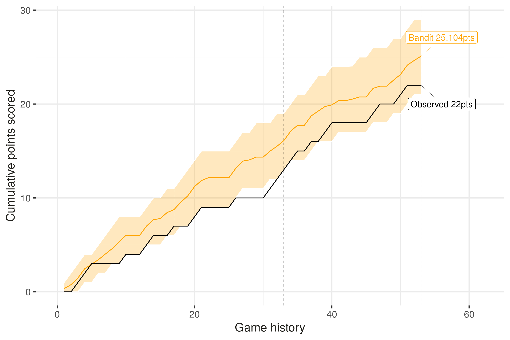

---

#### ovlytics: the volleyball bandit

- performance of my setter compared to optimum
- compare choices of bandit to choices of setter

---

# volleyreport [](https://www.tidyverse.org/lifecycle/#experimental)

https://openvolley.org/volleyreport/

- functions and templates to help write match / scouting / team reports
- some specific reports: so far single-page match summary reports

```{r echo = TRUE, eval = FALSE}
library(volleyreport)
vr_match_summary("myfile.dvw", format = "pdf")

## or customized
vr_match_summary("myfile.dvw", format = "pdf")
                 icon = "/my/logo.png", css = my_css)

```

---

#### volleyreport

<iframe style = "width:100%; height:500px;" src = "./match-report-1.pdf" />

---

#### volleyreport

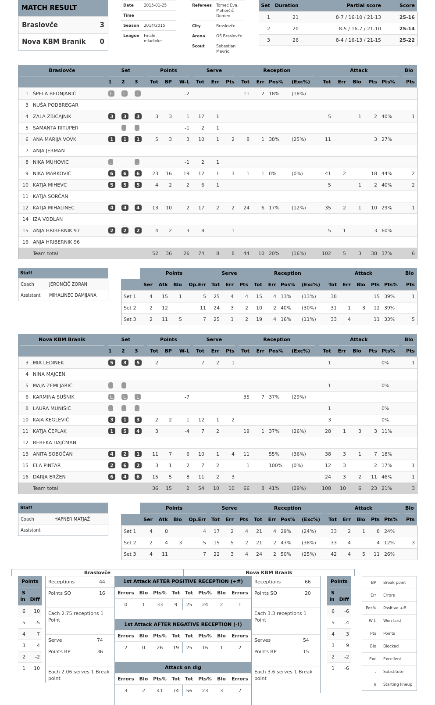
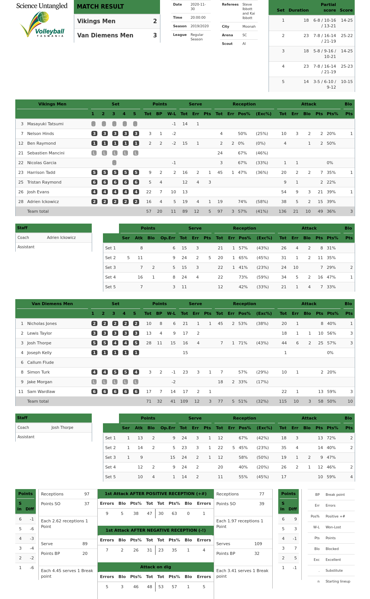

---

# sui18n     

With help from Felipe Lima, Miguel Rivera, Giorgio Poetto, Emilie Robles

- volleyball-specific translations (Brazilian Portuguese, Spanish, French, Italian)

```{r echo = TRUE}
library(sui18n)
tr <- sui_translator()
tr$t("Reception attack")
tr$set_target("pt-br")
tr$t("Reception attack")

```

- works dynamically in Shiny apps and HTML pages (used in https://apps.untan.gl/teamrep/)

---

# volleysim [](https://www.tidyverse.org/lifecycle/#experimental)

<span style="float:right; clear:none">https://openvolley.org/volleysim/</span>

Dwight Wynne

Given a set of parameters that describe the performance of two teams, simulate a match between them.

--

```{r prep, echo = FALSE}
rd1 <- function(z) round(z, 1)
options(dplyr.summarise.inform = FALSE)
vs_simulate_match <- function(...) {
    res <- volleysim::vs_simulate_match(...)
    c(c(pwin = round(res$pwin, 3)), round(unlist(res$scores), 3))
}

```

```{r sim1, echo = TRUE}
library(volleysim)

x <- dv_read(dv_example_file()) ## input file
## calculate the rates we need to simulate
rates <- vs_estimate_rates(x, target_team = "each")

```

--

Use just the sideout rates:

```{r sim1b, echo = TRUE}
rates$sideout

```

---

#### volleysim

Now simulate:

```{r sim1c, echo = TRUE}
vs_simulate_match(rates, process_model = "sideout")

```

--

Compare this to the actual match result:

```{r ex1b, echo = TRUE}
summary(x)

```

---

#### volleysim: exploring match options

Let's say we have two teams with the following season-average parameters:

```{r simex2a, message = FALSE}
rates <- tribble(~team, ~serve_ace, ~serve_error, ~rec_set_error, ~rec_att_error, ~rec_att_kill, ~rec_att_replayed, ~trans_set_error, ~trans_att_error, ~trans_att_kill, ~trans_att_replayed, ~sideout, ~rec_block, ~trans_block,
"My team",    0.062, 0.156, 0.009, 0.071, 0.499, 0.05, 0.018, 0.082, 0.452, 0.05, 0.668, 0.075, 0.079,
"Other team", 0.070, 0.190, 0.014, 0.063, 0.523, 0.05, 0.021, 0.102, 0.435, 0.05, 0.683, 0.083, 0.109)
knitr::kable(rates[, 1:8])

```

<br />

```{r}
knitr::kable(rates[, c(1, 9:ncol(rates))])

```

"My team" is due to play "Other team" in our next match.

---

#### volleysim: exploring match options

If we assume that both teams play to their season-average parameters:

```{r simex2ah, echo = FALSE}
set.seed(112)

```

```{r simex2b, echo = TRUE}
vs_simulate_match(rates, process_model = "phase")

```

Looks like we expect a close match, but My team is most probably going to lose.

Perhaps as the coach of My team there are some adjustments I could make &mdash; in choosing the players in our starting lineup, or in our match tactics.

---

#### volleysim: exploring match options

Option 1

Change one of our pass-hitters: Betty, who has a more aggressive serve and attack but who is a weaker passer than our starting pass-hitter Agnes. With Betty in the lineup instead of Agnes, we guesstimate some adjustments:

- increase my team's serve aces and errors by 1% each, and attack kills by 2%
- increase opposition serve aces from 7% to 8%

--

Now our expected outcome is slightly better:

```{r simex2c}
rates2 <- rates

## increase my team's serve aces and errors by 1% each, and attack kills by 2%
rates2[1, c("serve_ace", "serve_error", "rec_att_kill", "trans_att_kill")] <-
    rates2[1, c("serve_ace", "serve_error", "rec_att_kill", "trans_att_kill")] + c(0.01, 0.01, 0.02, 0.02)

## increase opposition serve aces by 1%
rates2[2, c("serve_ace")] <- rates2[2, c("serve_ace")] + 0.01
```

```{r simex2d, echo = TRUE}
vs_simulate_match(rates2, process_model = "phase")

```

---

#### volleysim: exploring match options

Option 2

Change our serving tactics: serve more aggressively in order to put more pressure on Other team's reception but accepting that we will make more serve errors in doing so.

- increase my team's serve aces by 2% and errors by 5%.
- decrease opposition reception kills by 5% due to their expected poorer passing

--
Giving:

```{r simex2e}
rates3 <- rates

## increase my team's serve aces by 2% and errors by 5%
rates3[1, c("serve_ace", "serve_error")] <- rates3[1, c("serve_ace", "serve_error")] + c(0.02, 0.05)

## decrease opposition reception kills by 5% due to their expected poorer passing
rates3[2, c("rec_att_kill")] <- rates3[2, c("rec_att_kill")] - 0.05
```

```{r simex2f, echo = TRUE}
vs_simulate_match(rates3, process_model = "phase")

```

This looks like it might be a better option (assuming, of course, that we have estimated the changes in rates correctly)

---

#### volleysim

Next steps: better parameterization, and estimation of parameters.

Then ... parameterize individual players? Simulate by rotation?

---

# Serve errors

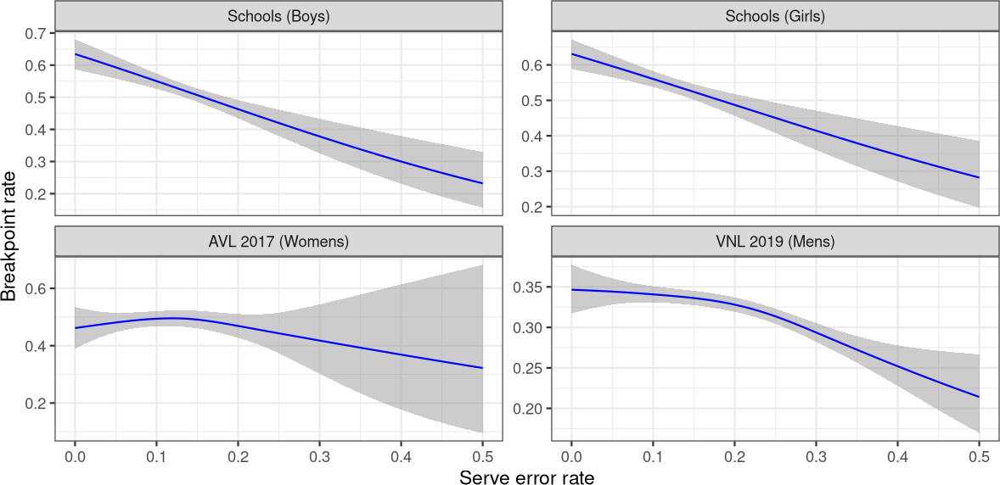

---

# fivbvis [](https://www.tidyverse.org/lifecycle/#experimental)

<span style="float:right; clear:none">https://openvolley.org/fivbvis/</span>

Tyler Widdison

Extract data from the FIVB information system

https://www.fivb.org/VisSDK/VisWebService/

Data on tournaments, players, results, media, and referees, from beach and indoor

---

#### fivbvis

```{r eval = FALSE, echo = TRUE}
library(fivbvis)
names(v_get_player(no = 100002))

```
```{r cache = TRUE}
library(fivbvis)
out <- v_get_player(100002)

```
```{r}
cat(names(out), fill = 75)

```

---

#### fivbvis

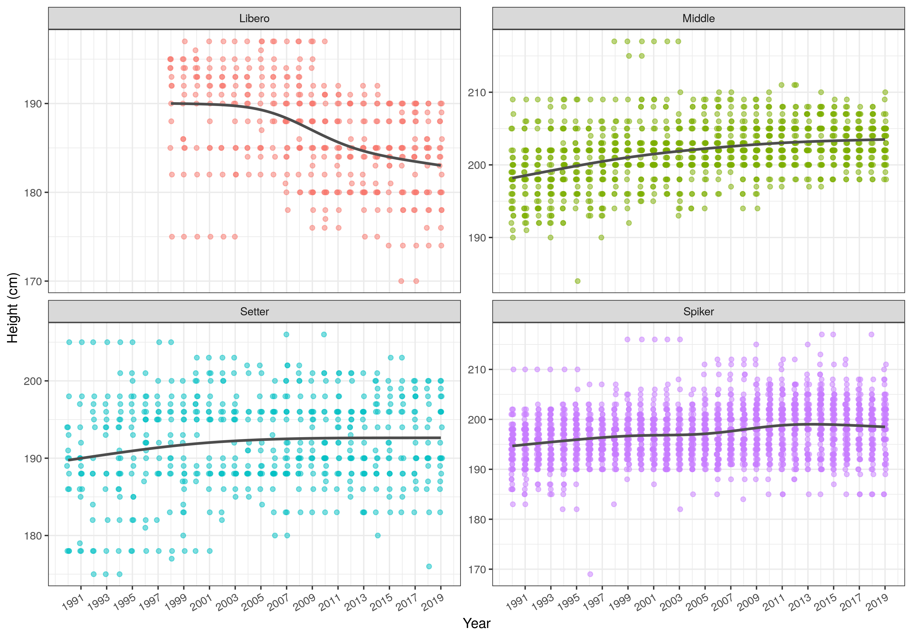

---

#### fivbvis

Passing performance as a function of player height:

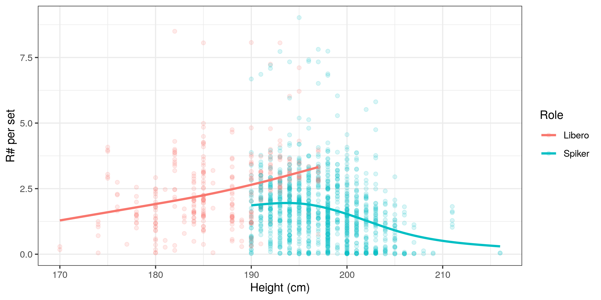

... Wait, <strong>*what*??</strong>

---

#### fivbvis

After accounting for the effect of year:

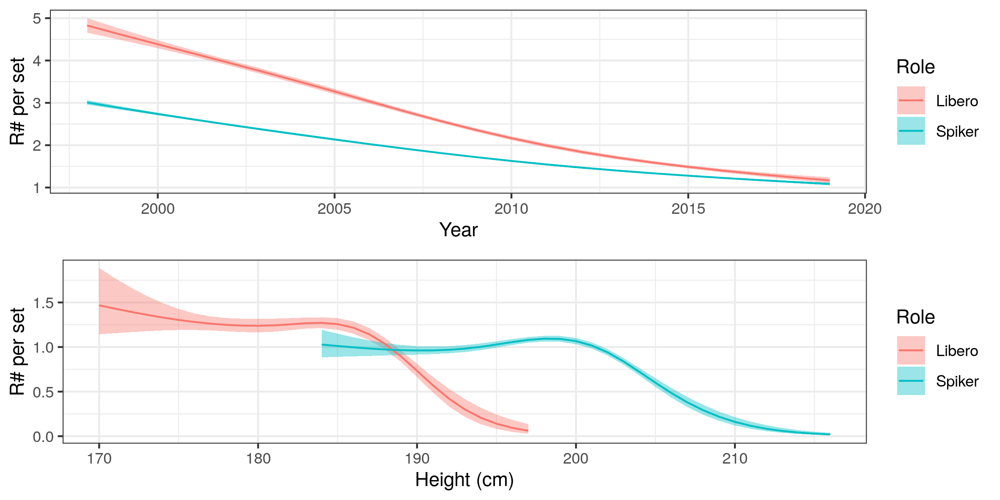

---

# ovideo [](https://www.tidyverse.org/lifecycle/#maturing)

<span style="float:right; clear:none">https://openvolley.org/ovideo/</span>

Video support functions:

- extract frames and clips from video
- generate playlists
- putting videos into web pages and Shiny apps
- transform from image to court coordinates
- overlays

---

#### ovideo: playlists

Playlists:

```{r echo = TRUE, eval = FALSE}
library(ovideo)

## read my dvw file
x <- ovdata_example(as = "parsed")
px <- plays(x)

## find pipe (XP) attacks in transition
px <- px[which(px$attack_code == "XP" & px$phase == "Transition"), ]

nrow(px)

```

```{r}
library(ovideo)
x <- ovdata_example(as = "parsed")
px <- plays(x)
x$meta$video <- tibble(camera = 0, file = basename(ovdata_example_video()))
px <- px[which(px$attack_code == "XP" & px$phase == "Transition"), ]
nrow(px)

```

```{r echo = TRUE}
ply <- ov_video_playlist(px, x$meta)
```

---

#### ovideo: playlists

```{r echo = TRUE}
ply
```

--

```{r echo = TRUE}
ov_playlist_to_vlc(ply)

```

---

# ovplayer [](https://www.tidyverse.org/lifecycle/#experimental)

<span style="float:right; clear:none">https://openvolley.org/ovplayer/</span>

Shiny video playlist player

```{r echo = TRUE}
library(ovplayer)

x <- dv_read("&2017.06.04 pol-iri 1-3.dvw")

## point the video to our YouTube URL
x$meta$video <-
    tibble(file = "https://youtube.com/watch?v=NisDpPFPQwU")

## generate our playlist
px <- plays(x)
px <- px[which(px$attack_code == "XP" & px$phase == "Transition"), ]
ply <- ov_video_playlist(px, x$meta)

```

---

#### ovplayer

```{r echo = TRUE}
ply

```

---

#### ovplayer

```{r echo = TRUE, eval = FALSE}
ovp_shiny(playlist = ply)

```

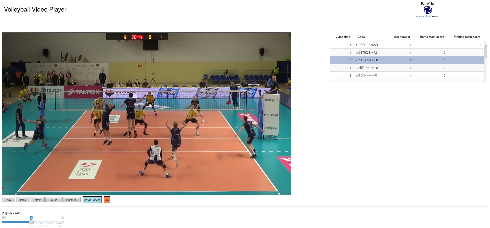

Next step: create standalone HTML file.

---

# ovva [](https://www.tidyverse.org/lifecycle/#maturing)

https://openvolley.org/ovva/

- interactive app for video analysis in conjunction with scout files
- multiple scout files/videos
- extended options for filtering

Start the shiny app with the path to your DataVolley files:

```{r eval = FALSE, echo = TRUE}
library(ovva)
ovva_shiny(data_path = c(PL2018 = "data/volley/PlusLiga-2018_19"))

```

The inbuilt demo:

```{r eval = FALSE, echo = TRUE}
ovva_shiny_demo()

```

---

#### ovva

<video src="ovva.mp4" controls height="500px" width="100%" />

---

#### ovva

- next steps: combine with other openvolley model outputs

- examine video alongside data, summary stats, *and model insights*

---

# Image processing

- limitations of scout data
- progress in image and video processing methods through deep learning

---

# ovml [](https://www.tidyverse.org/lifecycle/#experimental)

New! https://openvolley.org/ovml/

``` r
library(ovml)
img <- "2019_03_01-KATS-BEDS-frame.jpg"
ovml_plot(img)

```

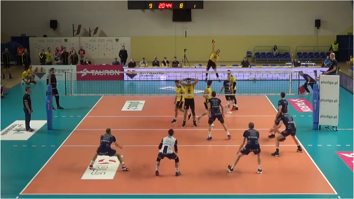

---

#### ovml

``` r
## construct the network (once)
dn <- ovml_yolo()

## detect objects
res <- ovml_yolo_detect(dn, img)
res <- res[res$class %in% c("person", "sports ball"), ]

## plot them
ovml_ggplot(img, res)

```

---

#### ovml

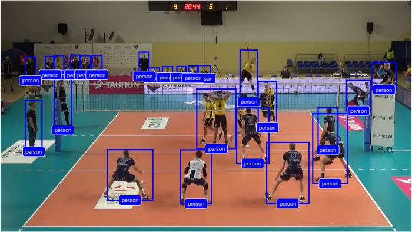

---

#### ovml

``` r
dn <- ovml_yolo("4-mvb")
res <- ovml_yolo_detect(dn, img)

```

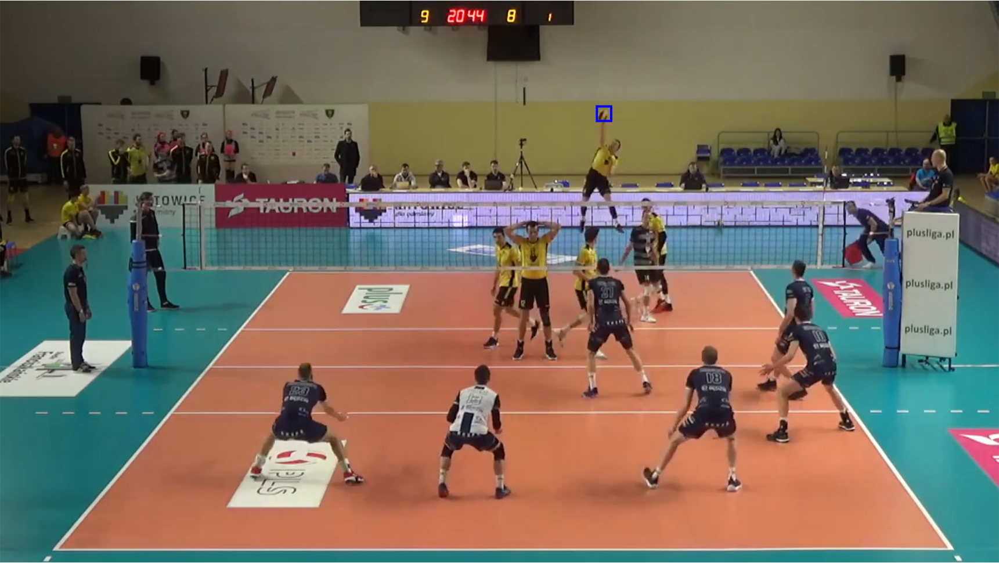

---

#### ovml

- R implementation using `torch`: no Python needed, no compilation from source needed.
- specific network for detecting volleyballs


Further work:

- improved ball detection (bigger training image set needed)
- R implementations of newer algorithms (waiting improved jit support in `torch`)
- fusion from multiple cameras

---

# Geometry (ovml/ovideo)

Define court reference points:

```{r echo = TRUE, eval = FALSE}
ov_shiny_court_ref(video_file = ov_example_video(), t = 5)

```

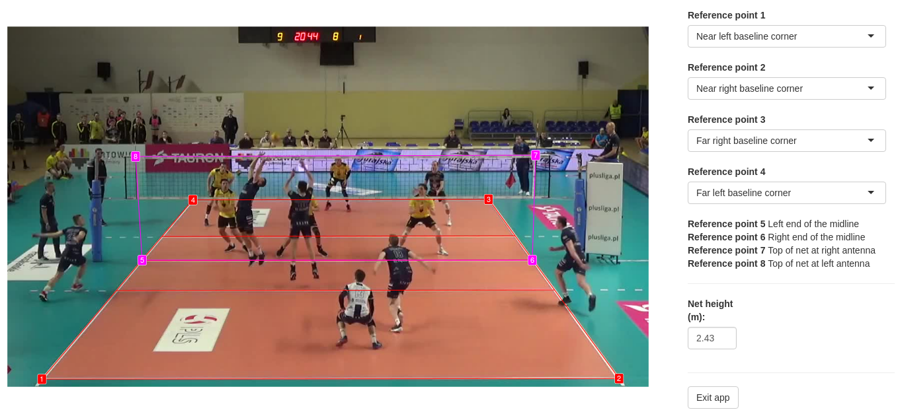

---

#### Geometry (ovml/ovideo)

Given the reference points in the image we can now:

- convert image coordinates to court coordinates and vice-versa

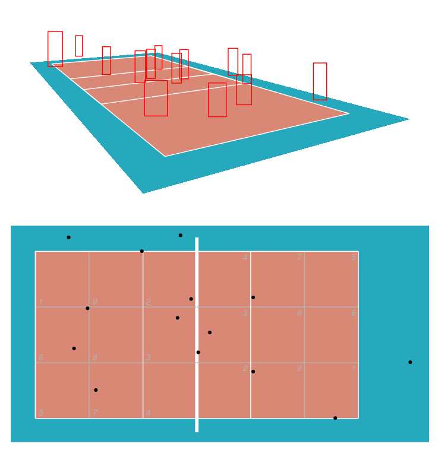


---

#### Geometry (ovml/ovideo): court positions

```{r eval = FALSE, echo = TRUE}
## video times of actions of interest
x <- plays(dv_read("myfile.dvw")) %>%
    dplyr::filter(attack_code %in% c("X5", "V5") &
                  team != "my team name")

## frames from video
imgs <- ov_video_frame(video_file, x$video_time)

## detect players
dets <- ovml_yolo_detect(net, imgs)

## convert to court coordinates
cxy <- ov_transform_points(x = (dets$xmin + dets$xmax)/2,
                           y = dets$ymin, ref = court_ref)

## plot
ggplot(...)

```

---

#### Geometry (ovml/ovideo): court positions

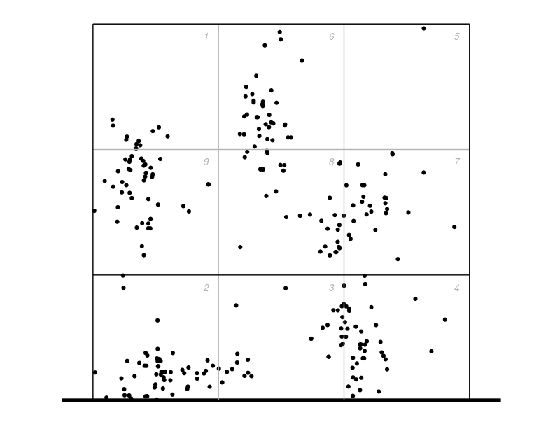

---

# ovtracking 

Geometry: next steps (in progress)

Estimate heights

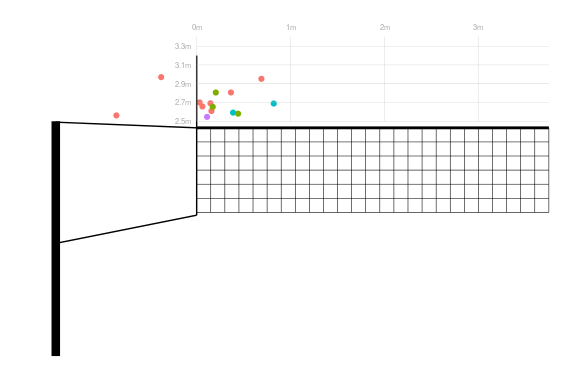

---

#### ovtracking

- build 3D models of scenes

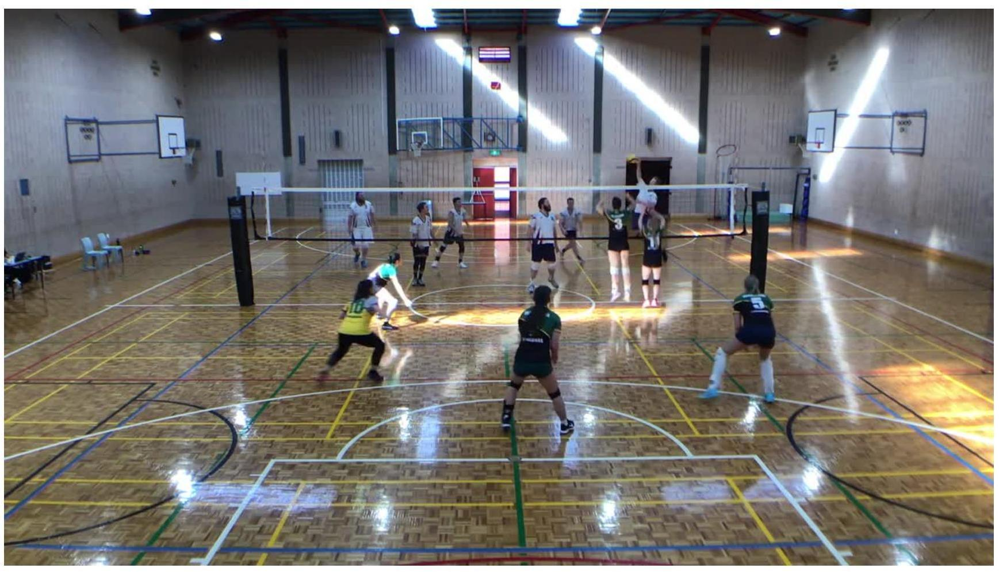

---

#### ovtracking: build 3D models of scenes

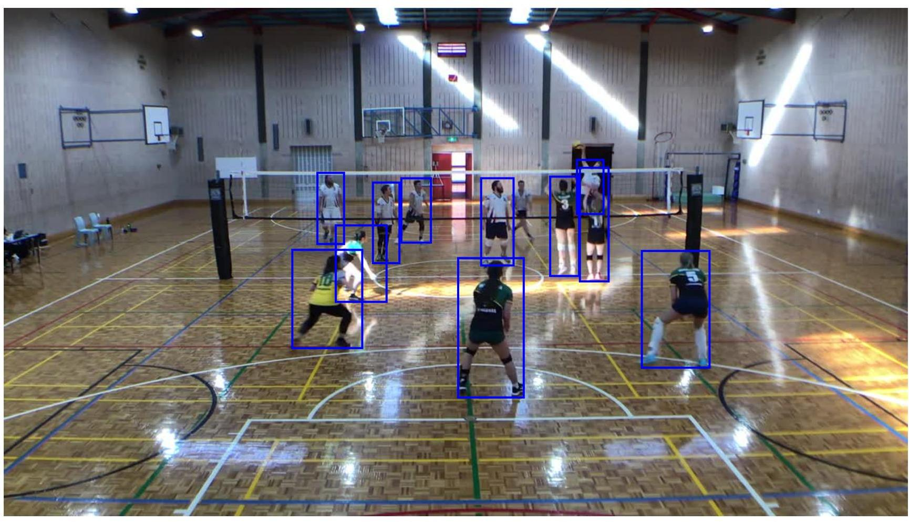

---

#### ovtracking: build 3D models of scenes

<iframe src="rgl1b.html" style = "width:100%; height:450px"/>

---

#### ovtracking: build 3D models of scenes

<iframe src="rgl1c.html" style = "width:100%; height:450px"/>

---

#### ovtracking: ball trajectories

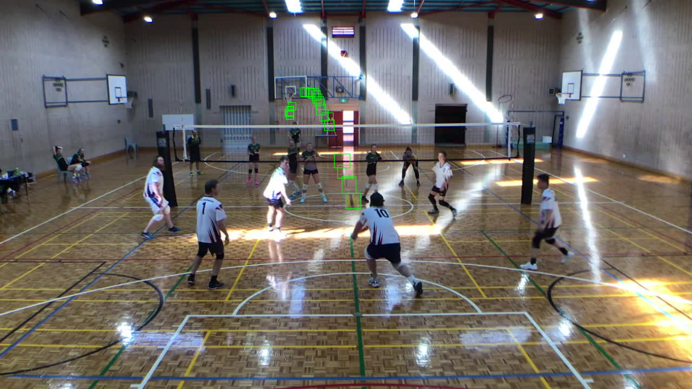

---

#### ovtracking: ball trajectories

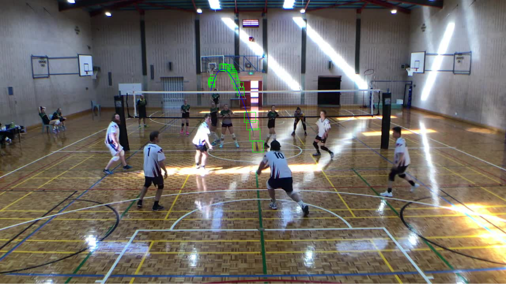

---

#### ovtracking: ball trajectories

<iframe src="ball_traj.html" style = "width:100%; height:450px"/>

---

#### ovtracking: player tracking

Limited success with already-available algorithms.

Volleyball-specific tracking:

- constraints and priors (e.g. players can't cross from one side of the net to another)
- additional information from scout data (which players most likely to be doing what)

---

#### ovtracking: player tracking


---

# Community resources

Analytics code snippets: https://openvolley.org/volley-analytics-snippets/

Each package has a README and documentation.

Discussion forum: https://github.com/openvolley/community/discussions

Data: ovdata package https://openvolley.org/ovdata/ [](https://www.tidyverse.org/lifecycle/#maturing)

---

# Want to contribute or get involved?

- bug reports and suggestions (via Github issues, e.g. https://github.com/openvolley/datavolley/issues/)
- app, code testing
- documentation improvements
- analysis ideas
- labelling training images
- contribute data (match files, other?)
- code snippets
- community engagement, spread the word!

---

class: middle

# We're done!


![:iem untan.gl, ben]

![:iem untan.gl, adrien]
